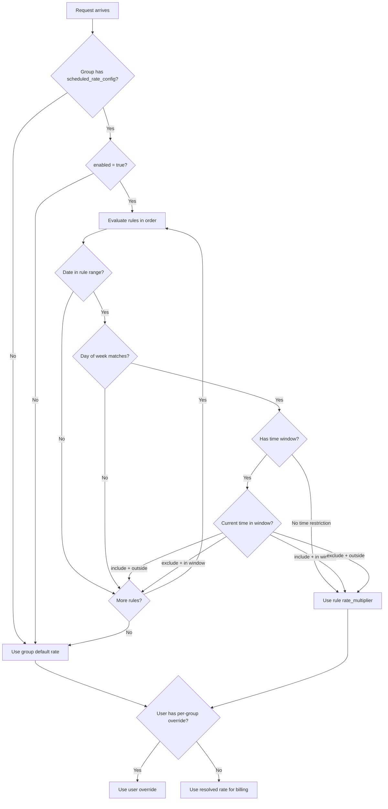

# Scheduled Rate Multiplier for User Groups

## Design

A new `scheduled_rate_config` JSONB column on the `groups` table stores a **rules array**. Each rule can target specific days of the week (weekdays, weekends, or custom) with its own time window, include/exclude mode, date range, and multiplier. Rules are evaluated in order; the first matching rule wins. If no rule matches, the group's default `rate_multiplier` is used.

All times are stored and evaluated in the **server timezone** (`config.timezone`, default `Asia/Shanghai`), using the existing `timezone` package (`timezone.Now()`, `timezone.Location()`). No per-rule timezone needed.

### Resolution Order

```
User per-group override > Effective Group Rate (first matching rule, or default) > System default
```

### JSON Schema for `scheduled_rate_config`

```json
{
  "enabled": true,
  "rules": [
    {
      "rate_multiplier": 0.5,
      "time_start": "00:00",
      "time_end": "12:00",
      "time_mode": "include",
      "days": [1, 2, 3, 4, 5],
      "date_start": "2026-03-16",
      "date_end": "2026-03-29"
    },
    {
      "rate_multiplier": 0.5,
      "days": [0, 6],
      "date_start": "2026-03-16",
      "date_end": "2026-03-29"
    }
  ]
}
```

**Rule fields:**

- `rate_multiplier` (float64, required): Override multiplier for this rule
- `time_start`, `time_end` (string "HH:MM", optional): Daily time window in server TZ. Empty/omitted = all day
- `time_mode` ("include" | "exclude", default "include"): Whether the scheduled rate applies DURING or OUTSIDE the time window
- `days` ([]int, optional): Days of week (0=Sun, 1=Mon...6=Sat). Empty/omitted = every day
- `date_start`, `date_end` (string "YYYY-MM-DD", optional): Active date range in server TZ. Empty/omitted = always active

### Example: 0.5x outside 12-6pm on weekdays, 0.5x all day on weekends, Mar 16-29

Rule 1 (weekdays): `days=[1,2,3,4,5]`, `time_start="12:00"`, `time_end="18:00"`, `time_mode="exclude"`, `rate=0.5`
Rule 2 (weekends): `days=[0,6]`, no time restriction, `rate=0.5`




---

## Backend Changes

### 1. Migration -- [backend/migrations/074_add_group_scheduled_rate_config.sql](backend/migrations/074_add_group_scheduled_rate_config.sql)

```sql
ALTER TABLE groups ADD COLUMN IF NOT EXISTS scheduled_rate_config JSONB DEFAULT NULL;
```

### 2. Ent Schema -- [backend/ent/schema/group.go](backend/ent/schema/group.go)

Add a new JSONB field, following the `model_routing` pattern:

```go
field.JSON("scheduled_rate_config", map[string]any{}).
    Optional().
    Nillable().
    SchemaType(map[string]string{dialect.Postgres: "jsonb"}).
    Comment("定时费率倍数配置：规则数组，支持按星期/时间段/日期范围覆盖默认倍率"),
```

Then run `go generate ./ent` to regenerate.

### 3. Service Model -- [backend/internal/service/group.go](backend/internal/service/group.go)

New types and method:

```go
type ScheduledRateRule struct {
    RateMultiplier float64 `json:"rate_multiplier"`
    TimeStart      string  `json:"time_start,omitempty"`  // "HH:MM", empty = all day
    TimeEnd        string  `json:"time_end,omitempty"`    // "HH:MM"
    TimeMode       string  `json:"time_mode,omitempty"`   // "include" (default) or "exclude"
    Days           []int   `json:"days,omitempty"`        // 0=Sun..6=Sat, empty = every day
    DateStart      string  `json:"date_start,omitempty"`  // "2006-01-02", empty = no start limit
    DateEnd        string  `json:"date_end,omitempty"`    // "2006-01-02", empty = no end limit
}

type ScheduledRateConfig struct {
    Enabled bool                `json:"enabled"`
    Rules   []ScheduledRateRule `json:"rules"`
}
```

Add `ScheduledRateConfig *ScheduledRateConfig` field to `Group` struct.

Add `GetEffectiveRateMultiplier(now time.Time) float64` method on `Group`:

- Returns `g.RateMultiplier` if config is nil, not enabled, or no rules match
- Iterates rules; for each rule, checks date range, day-of-week, then time window (with include/exclude logic)
- First matching rule's `rate_multiplier` is returned
- **Fail-open**: any parse error causes the rule to be skipped (returns default)
- Uses `now` parameter (already in server TZ from `timezone.Now()`) directly for all comparisons

**DST-safe implementation**: The method never constructs a `time.Time` from the rule's HH:MM strings (which could hit DST gaps/overlaps). Instead it:

1. Reads `now.Hour()` and `now.Minute()` from the passed-in time (always valid -- Go's `timezone.Now()` returns the correct DST-adjusted local time)
2. Parses rule's `time_start`/`time_end` into integer minutes-since-midnight (`h*60+m`)
3. Compares purely with integer arithmetic: `currentMinutes` vs `startMinutes`/`endMinutes`

This avoids all DST edge cases:

- **Spring forward** (e.g. 2:00 AM jumps to 3:00 AM): `now.Hour()` will be 3, never 2. A rule with `time_start="02:00"`, `time_end="03:00"` simply has zero matching time on that day -- correct behavior.
- **Fall back** (e.g. 2:00 AM repeats): `now.Hour()` returns the wall clock hour, so the rule still matches by wall clock -- consistent and predictable.

### 4. Comprehensive Unit Tests -- [backend/internal/service/group_scheduled_rate_test.go](backend/internal/service/group_scheduled_rate_test.go)

New test file (`//go:build unit`) using table-driven tests with `require`. Test cases:

**Basic scenarios:**

- **No config / disabled**: returns default rate
- **Single rule, no time/day/date restrictions**: always returns scheduled rate
- **Config with empty rules array**: returns default rate

**Date range:**

- Before start date, within range, after end date
- `date_start` only (no end), `date_end` only (no start)
- Single-day range (`date_start == date_end`)

**Day-of-week:**

- Weekday-only rule (`days=[1,2,3,4,5]`) tested on Monday (match) and Saturday (no match)
- Weekend-only rule (`days=[0,6]`) tested on Sunday (match) and Wednesday (no match)
- Empty `days` = every day

**Time window include mode:**

- Before window, inside window, after window
- Exactly at window start (match), exactly at window end (no match -- exclusive end)

**Time window exclude mode:**

- Before window (match), inside window (no match), after window (match)

**Overnight time window:**

- `time_start="22:00"`, `time_end="06:00"` -- tested at 23:00 (in window), 03:00 (in window), 14:00 (out of window)

**Multiple rules (first-match wins):**

- Weekday rule before weekend rule; verify correct rule fires on Monday vs Sunday
- Two overlapping rules; first one wins

**DST-specific test cases:**

- **Spring forward simulation**: `now` at 3:00 AM on spring-forward day; rule covers 2:00-4:00 -- should match (3:00 is in range)
- **Rule in DST gap**: `time_start="02:00"`, `time_end="02:59"` with `now` at 3:00 AM post-spring-forward -- should NOT match
- **Fall back simulation**: `now` at 1:30 AM; rule covers 1:00-2:00 -- should match regardless of which "1:30" it is (we compare wall clock)

**Malformed data (fail-open):**

- Invalid time format (e.g. "25:00", "ab:cd", "1:2:3") -- rule skipped, returns default
- Invalid date format (e.g. "2026-13-01", "not-a-date") -- rule skipped, returns default
- Negative or out-of-range day values -- rule skipped

**Edge cases:**

- Midnight boundary: `time_start="00:00"`, `time_end="00:00"` (same = no window = all day)
- `time_start="23:59"`, `time_end="00:01"` (1-minute overnight window)
- Rule with `rate_multiplier=0` (valid -- free tier)

### 5. Admin Service Inputs -- [backend/internal/service/admin_service.go](backend/internal/service/admin_service.go)

Add `ScheduledRateConfig *ScheduledRateConfig` to `CreateGroupInput` and `UpdateGroupInput`.

Wire through `CreateGroup` / `UpdateGroup` methods: set `group.ScheduledRateConfig = input.ScheduledRateConfig`.

### 6. Handler DTOs -- [backend/internal/handler/admin/group_handler.go](backend/internal/handler/admin/group_handler.go)

Add to both `CreateGroupRequest` and `UpdateGroupRequest`:

```go
ScheduledRateConfig *service.ScheduledRateConfig `json:"scheduled_rate_config"`
```

Pass through to `CreateGroupInput` / `UpdateGroupInput` in the handler methods.

### 7. DTO Types and Mapper

**[backend/internal/handler/dto/types.go](backend/internal/handler/dto/types.go):**

Add to `AdminGroup` struct:

```go
ScheduledRateConfig *service.ScheduledRateConfig `json:"scheduled_rate_config,omitempty"`
ServerTimezone      string                        `json:"server_timezone"`
```

**[backend/internal/handler/dto/mappers.go](backend/internal/handler/dto/mappers.go):**

In `GroupFromServiceAdmin`:

```go
ScheduledRateConfig: g.ScheduledRateConfig,
ServerTimezone:      timezone.Name(),
```

### 8. Repository

**[backend/internal/repository/group_repo.go](backend/internal/repository/group_repo.go):**

In `Create()` and `Update()`:

- Convert `groupIn.ScheduledRateConfig` to `map[string]any` via JSON marshal/unmarshal and call `SetScheduledRateConfig`
- When nil, call `ClearScheduledRateConfig()` in Update

**[backend/internal/repository/api_key_repo.go](backend/internal/repository/api_key_repo.go):**

In `groupEntityToService()` (~line 616): Parse `g.ScheduledRateConfig` (`map[string]any`) back into `*service.ScheduledRateConfig` via JSON round-trip. Return nil on parse error (fail-open).

### 9. Auth Cache Path (CRITICAL -- missed in original plan)

The hot path for authenticated API requests loads group data via `GetByKeyForAuth()` and caches it in `APIKeyAuthGroupSnapshot`. Without updating this path, **most real traffic will not see the schedule config**.

**[backend/internal/repository/api_key_repo.go](backend/internal/repository/api_key_repo.go) -- `GetByKeyForAuth()` (~line 117):**

Add `group.FieldScheduledRateConfig` to the `.Select()` list inside `WithGroup()`:

```go
WithGroup(func(q *dbent.GroupQuery) {
    q.Select(
        // ... existing fields ...
        group.FieldScheduledRateConfig,  // NEW
    )
}).
```

**[backend/internal/service/api_key_auth_cache.go](backend/internal/service/api_key_auth_cache.go) -- `APIKeyAuthGroupSnapshot` struct (~line 39):**

Add field:

```go
ScheduledRateConfig *ScheduledRateConfig `json:"scheduled_rate_config,omitempty"`
```

**[backend/internal/service/api_key_auth_cache_impl.go](backend/internal/service/api_key_auth_cache_impl.go) -- `snapshotFromAPIKey()` (~line 224):**

Add mapping in the group snapshot construction:

```go
ScheduledRateConfig: apiKey.Group.ScheduledRateConfig,
```

**[backend/internal/service/api_key_auth_cache_impl.go](backend/internal/service/api_key_auth_cache_impl.go) -- `snapshotToAPIKey()` (~line 282):**

Add mapping in the group reconstruction:

```go
ScheduledRateConfig: snapshot.Group.ScheduledRateConfig,
```

### 10. Auth Cache Round-Trip Test

Add a test in [backend/internal/service/api_key_service_cache_test.go](backend/internal/service/api_key_service_cache_test.go) (or new file) that:

1. Creates an `APIKey` with a `Group` containing a `ScheduledRateConfig` with multiple rules
2. Calls `snapshotFromAPIKey` to serialize
3. Calls `snapshotToAPIKey` to deserialize
4. Asserts `ScheduledRateConfig` survives the round-trip with all fields intact (Enabled, Rules, each rule's days/times/dates/mode)

### 11. Gateway Integration (ALL billing paths)

**Three** call sites where the group default rate must use `GetEffectiveRateMultiplier`:

**[backend/internal/service/gateway_service.go](backend/internal/service/gateway_service.go) -- `RecordUsage()` (line 7484):**

```go
// Before:
groupDefault := apiKey.Group.RateMultiplier
// After:
groupDefault := apiKey.Group.GetEffectiveRateMultiplier(time.Now())
```

**[backend/internal/service/gateway_service.go](backend/internal/service/gateway_service.go) -- `RecordUsageWithLongContext()` (line 7756):**

```go
// Before:
groupDefault := apiKey.Group.RateMultiplier
// After:
groupDefault := apiKey.Group.GetEffectiveRateMultiplier(time.Now())
```

**[backend/internal/service/openai_gateway_service.go](backend/internal/service/openai_gateway_service.go) -- `RecordUsage` (line 4074):**

```go
// Before:
multiplier = resolver.Resolve(ctx, user.ID, *apiKey.GroupID, apiKey.Group.RateMultiplier)
// After:
multiplier = resolver.Resolve(ctx, user.ID, *apiKey.GroupID, apiKey.Group.GetEffectiveRateMultiplier(time.Now()))
```

---

## Frontend Changes

### 12. Timezone Approach

**All times, days, and dates are displayed and entered in server timezone.** No client-side conversion. This eliminates all cross-midnight/cross-day bugs and keeps the implementation simple.

The API response includes `server_timezone` (e.g. "Asia/Shanghai"). The frontend displays a persistent timezone label/warning next to the time inputs: "All times are in server timezone (Asia/Shanghai)". This is clear, unambiguous, and avoids any conversion errors.

### 13. Types -- [frontend/src/types/index.ts](frontend/src/types/index.ts)

```typescript
export interface ScheduledRateRule {
  rate_multiplier: number
  time_start?: string    // "HH:MM" (stored in server TZ)
  time_end?: string      // "HH:MM" (stored in server TZ)
  time_mode?: 'include' | 'exclude'
  days?: number[]        // 0=Sun..6=Sat
  date_start?: string    // "YYYY-MM-DD"
  date_end?: string      // "YYYY-MM-DD"
}

export interface ScheduledRateConfig {
  enabled: boolean
  rules: ScheduledRateRule[]
}
```

Add `scheduled_rate_config?: ScheduledRateConfig | null` to `AdminGroup`, `CreateGroupRequest`, `UpdateGroupRequest`.
Add `server_timezone?: string` to `AdminGroup`.

### 14. GroupsView.vue Form State -- [frontend/src/views/admin/GroupsView.vue](frontend/src/views/admin/GroupsView.vue)

This file has **duplicated create/edit form state**, **duplicated modal templates**, **explicit reset logic**, **explicit edit hydration**, and **explicit request assembly**. Every path must be updated:

**Create form state** (~line 2015-2028): Add `scheduled_rate_config` field:

```typescript
scheduled_rate_config: null as ScheduledRateConfig | null,
```

**Edit form state** (~line 2236-2272): Add same field:

```typescript
scheduled_rate_config: null as ScheduledRateConfig | null,
```

**Edit prefill / hydration** in `handleEdit()` (~line 2402-2433): Add:

```typescript
editForm.scheduled_rate_config = group.scheduled_rate_config
  ? JSON.parse(JSON.stringify(group.scheduled_rate_config))  // deep clone
  : null
```

**Create modal reset** in `closeCreateModal()` (~line 2337-2368): Add:

```typescript
createForm.scheduled_rate_config = null
```

**Edit modal reset** in `closeEditModal()` (~line 2436-2445): Add:

```typescript
editForm.scheduled_rate_config = null
```

**Create submit** in `handleCreateGroup()` (~line 2371-2400): The request spreads `createForm` into the payload. `scheduled_rate_config` is already in server TZ -- no conversion needed.

**Edit submit** in `handleUpdateGroup()` (~line 2447-2469): Same -- no conversion needed, times are already in server TZ.

### 15. GroupsView.vue Template -- [frontend/src/views/admin/GroupsView.vue](frontend/src/views/admin/GroupsView.vue)

Add a "Scheduled Rate Override" section below the Rate Multiplier input in **both** the create modal (~~line 326-336) and edit modal (~~line 1053-1064). Matching existing patterns:

- **Timezone label** at the top of the section: `p.input-hint` with info icon -- "All times are in server timezone ({server_timezone})"
- **Enable toggle**: Same pattern as `is_exclusive` toggle (~line 370-388)
- **Rules list** with Add/Remove buttons:
  - Rate multiplier: `<input type="number" step="0.001" min="0">` (same class as `rate_multiplier` input)
  - Day-of-week: checkbox group with quick-select buttons (Weekdays / Weekend / All)
  - Time window: two `<input type="time">` fields
  - Time mode: two radio buttons -- "Apply during window" / "Apply outside window"
  - Date range: two `<input type="date">` fields

No timezone conversion is needed -- admin enters times directly in server timezone.

### 16. i18n Locales

**[frontend/src/i18n/locales/en.ts](frontend/src/i18n/locales/en.ts):**

- `admin.groups.scheduledRate.title`: "Scheduled Rate Override"
- `admin.groups.scheduledRate.hint`: "Override the default rate multiplier based on time-of-day, day-of-week, and date range rules"
- `admin.groups.scheduledRate.timezoneWarning`: "All times are in server timezone ({timezone})"
- `admin.groups.scheduledRate.addRule`: "Add Rule"
- `admin.groups.scheduledRate.removeRule`: "Remove"
- `admin.groups.scheduledRate.rateMultiplier`: "Rate Multiplier"
- `admin.groups.scheduledRate.days`: "Days of Week"
- `admin.groups.scheduledRate.weekdays`: "Weekdays"
- `admin.groups.scheduledRate.weekend`: "Weekend"
- `admin.groups.scheduledRate.allDays`: "All"
- `admin.groups.scheduledRate.timeWindow`: "Time Window"
- `admin.groups.scheduledRate.timeStart`: "Start"
- `admin.groups.scheduledRate.timeEnd`: "End"
- `admin.groups.scheduledRate.timeModeInclude`: "Apply during window"
- `admin.groups.scheduledRate.timeModeExclude`: "Apply outside window"
- `admin.groups.scheduledRate.dateRange`: "Date Range"
- `admin.groups.scheduledRate.dateStart`: "Start Date"
- `admin.groups.scheduledRate.dateEnd`: "End Date"
- `admin.groups.scheduledRate.noRules`: "No rules configured"

**[frontend/src/i18n/locales/zh.ts](frontend/src/i18n/locales/zh.ts):** Chinese equivalents.